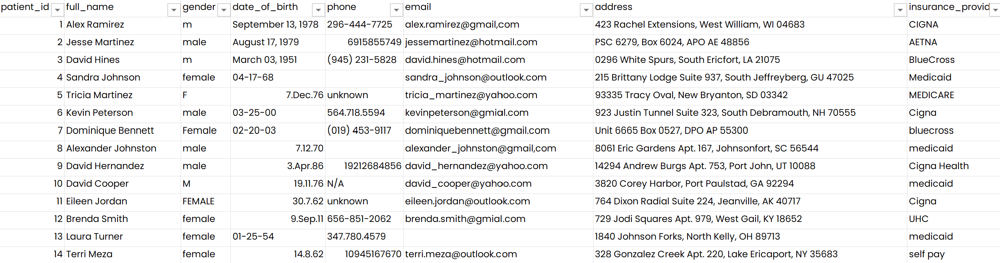
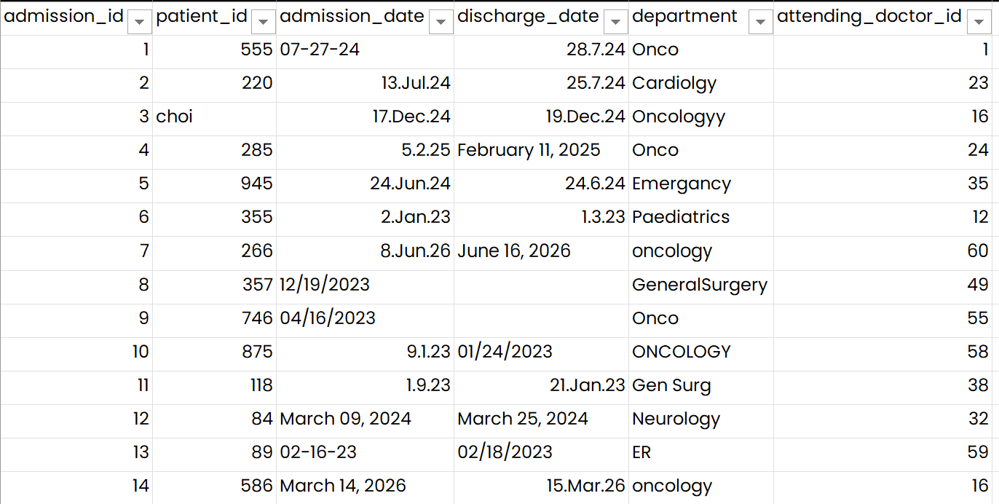
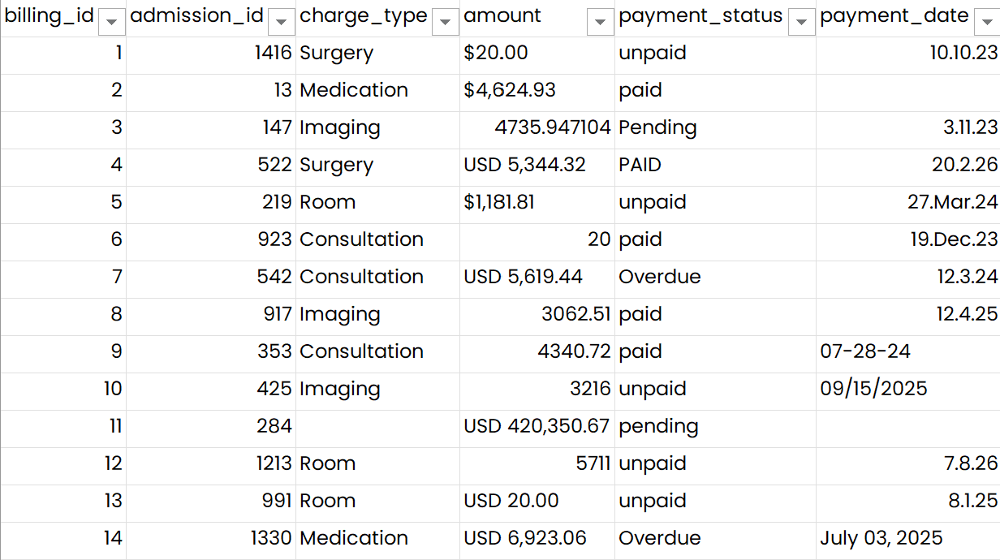
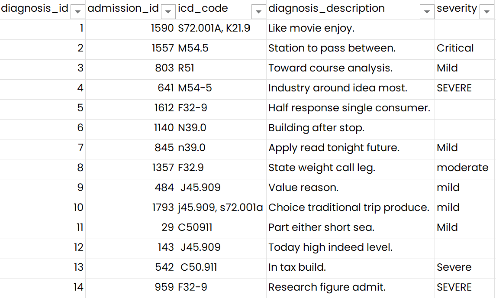
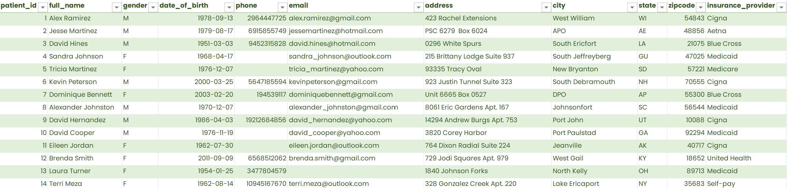
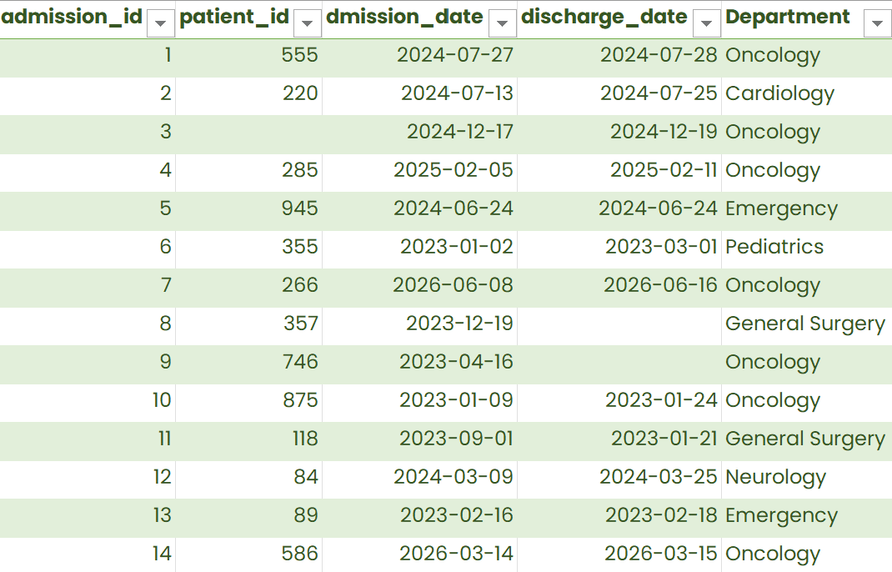
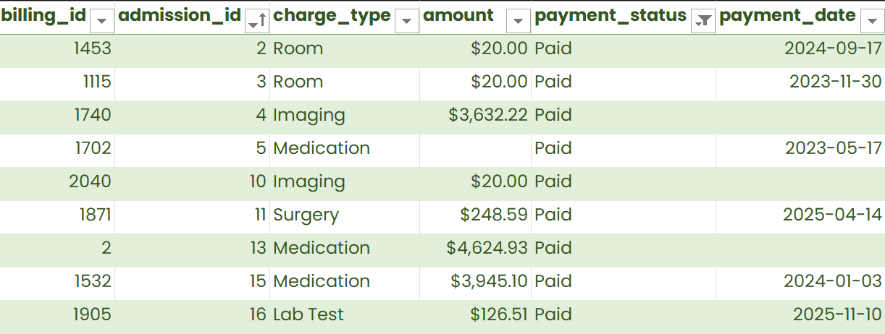
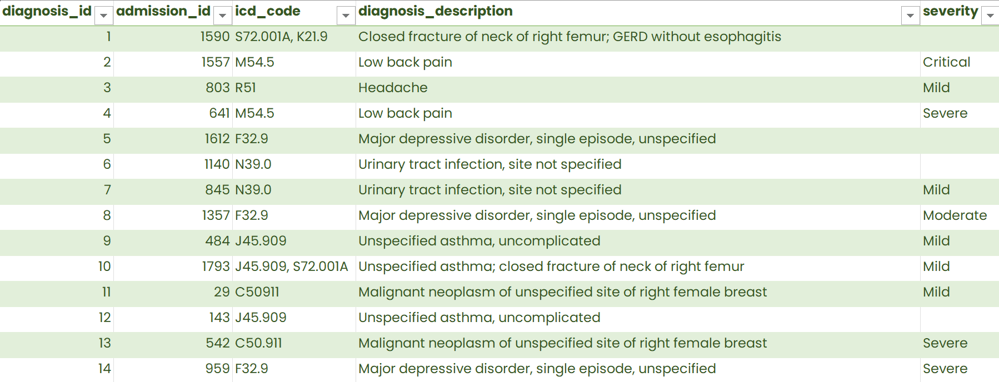

## Project Overview
This project focuses on cleaning raw dataset containing healthcare admissions and transactions. The original file included inconsistent formatting, missing value, incorrect date formats, duplicate records, and non-standardized categories.

All cleaning was performed in Microsoft Excel, using formulas, power query, and validation tools.

## Dataset Description
Source: [Kaggle - Healthcare Data Cleaning (hard)](https://www.kaggle.com/datasets/nudratabbas/healthcare-data-cleaning-hard/data)<br>
Files: 4 csv files <br>
Columns: 25

### Key fields
- admission_id
- patient_id
- billing_id
- insurance_provider
- department

### Initial issues identified
- Mixed date formats (DD/MM/YY, DD-MM-YY, MM.DD.YY, text dates)
- Amounts stored as text
- Duplicate rows
- Extra spaces and non-printable characters in text fields
- Missing values
- Inconsistent category labels

## Data Cleaning Steps
### 1. Removed duplicates
- Used **Remove duplicates** tool in Excel
- Removed 15 duplicate rows in **Patients** table
### 2. Standardized Date Formats
- Created 3 columns (Year, Month, Day) to extract dates using formula:
```formula
Month =IFERROR(VALUE(IF(LEFT(C2,2)>"12",MID(C2,4,2),LEFT(C2,2))),"")
Day =IFERROR(VALUE(IF(AND(LEFT(C2,2)>"12",MID(C2,4,2)>="12"),LEFT(C2,2),MID(C2,4,2))),"")
Year=IFERROR(2000+RIGHT(C2,2),"")
YMD =IFERROR(DATE(F2,D2,E2),C2)
```
- Used **Power Query** to format text dates into date
- Used formatting to standardized all dates into YYYY-MM-DD
### 3. Corrected Data types
- Converted **Amount** into numeric and formatted as currency
- Cleaned text fields using:
  - **TRIM()**
  - **CLEAN()**
  - **PROPER()**
- Corrected spelling mistakes from the **address column**
### 4. Fixed Category Inconsistencies
- Standardized **Gender**, **Payment_Status**, and **Insurance_provider** columns
- Created a unique **Department** table and applied **Fuzzy Merge** to standardize and replace inconsistent department names
### 5. Created and Removed Columns
- Separated address and created new columns for Address, City, State, and Zip code
- Removed irrelevant column - **attending_doctor_id** as it does not have any relationship to any of the table

## Before & After Samples
### Raw Data
|Date_of_birth|Amount|Department|
|-------------|------|----------|
|September 13, 1978|USD 5,344.32|Onco|
|7.12.1976|$20.00|GeneralSurgery|
|01-25-54|5711|CARDIOLOGY
|07/16/1997|10209.6588471341|Peds|

### Cleaned Data
|Date_of_birth|Amount|Department|
|-------------|------|----------|
|1978-09-13|$5,344.32|Oncology|
|1976-07-12|$20.00|General Surgery|
|1954-01-25|$5,711.00|Cardiology|
|1997-07-16|$10,209.66|Pediatrics|

### Screenshots
<details>
  <summary><b>Raw Tables</b></summary> 





</details>
<details>
  <summary><b>Cleaned Tables</b></summary>





</details>

## Challenges & Decisions

