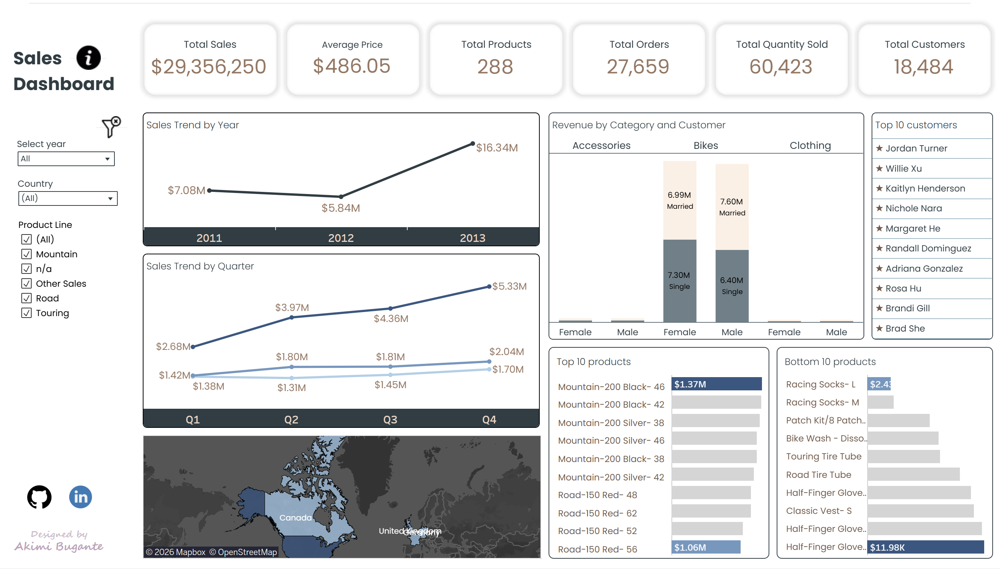

# Project Overview
  This project analyzes store-level sales performance to uncover key revenue drivers. It identifies trends across products, regions, and customer segments, highlights the areas contributing most to overall sales, and delivers actionable recommendations for business stakeholders.
#### Key skills demonstrated:
- SQL (Joins, CTEs, Window functions, aggregations)
- Exploratory Data Analysis
- Tableau Visualization
- Business insight

## Business Questions
1. How do yearly and quarterly sales trends change over time?
2. Which products perform best and worst?
3. What do the core KPIs (Sales, Products, Customers, Avg Price, Quantity Sold) reveal?
4. How are customers segmented by spending levels?
5. Who are the top revenue‑generating customers?

## Exploratory Data Analysis
- Mountain and Road bikes are the top revenue drivers.
- United States has the largest consumers based but France produced the highest-value customers.
- Road bike prices dropped by 50% in year 2012, indicating a significant shift in pricing.
- 2013 recorded the highest sales with Mountain Bikes as the highest contributor.
- Sales performance show no meaningful difference between male and female customer groups. Both contribute significantly to total revenue.

## Tableau Dashboard
- KPI Summary
- Yearly and Quarterly sales trend
- Category level sales performance
- Top and Bottom products by Sales
]

## Recommendations
- Increase targeted campaigns to young adults, especially in Mountain and Road Bikes.
- Develop targeted campaigns for French consumers, leveraging their strong purchasing behaviour.
- Launch seasonal promotions aligned with Tour De France to drive higher engagement for Mountain and Road bikes.
- Review Road bike pricing strategy to ensure consistency across years.
- Add bundle promotions to increase sales in clothing and accessories.
- Conduct a deeper analysis in 2013 improvements to replicate winning strategies in future periods.
